# CS2 Player Intel

A Windows companion app for your own CS2 matches. It finds the other players in your match (up to 9 in Premier or Competitive, 5 in Rush, 3 in Wingman, 15 in Deathmatch, 19 in Casual), collects what Leetify, FACEIT, CSStats, CSRep and Steam publish about them, and shows it in an overlay next to CS2's scoreboard.

Built with Rust and Tauri 2, using Windows WebView2 rather than bundling Chromium. It runs outside CS2: no game-memory reading or writing, code injection, game hooks, or gameplay automation. This is not an anti-cheat approval or a guarantee against account restrictions.

By [KKNZ89](https://github.com/KKNZ89) · [Releases](https://github.com/KKNZ89/cs2-player-intelligence-overlay/releases) · [Issues](https://github.com/KKNZ89/cs2-player-intelligence-overlay/issues)

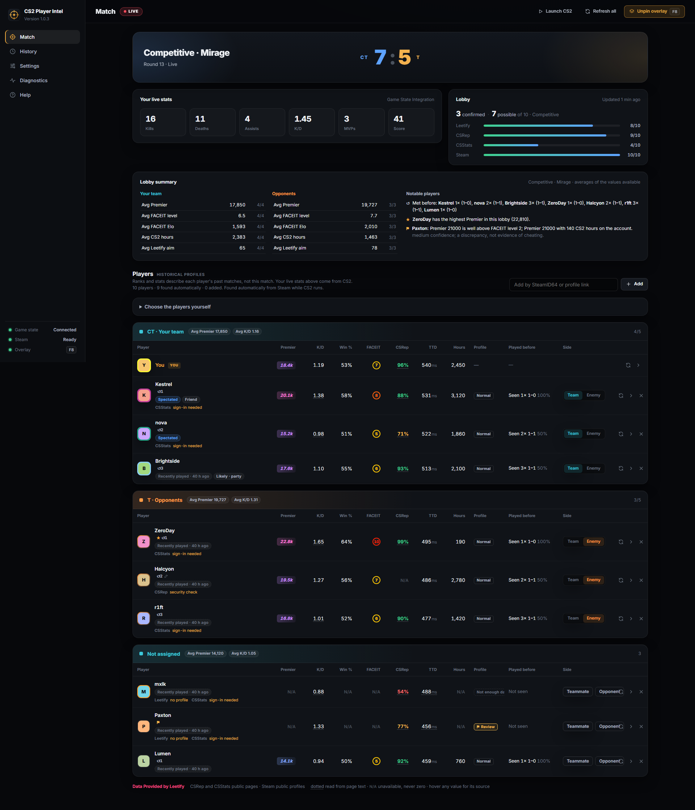

| Compact overlay (hold Tab) | Esc menu: click a player |
|---|---|
| 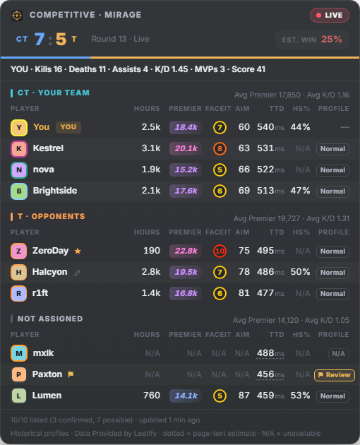 | 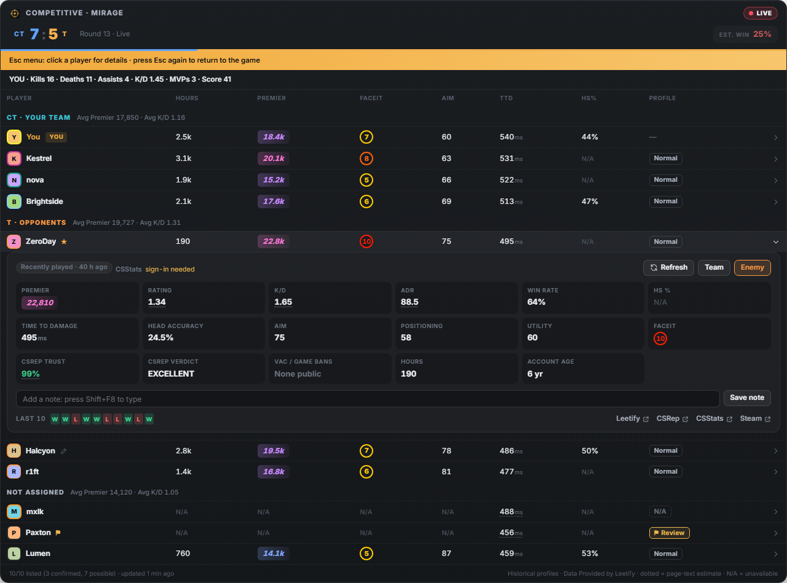 |

Screenshots are generated from the current interface with entirely fictional player data. They do not show a live match or prove provider availability.

**Quick links:** [Install](#install) · [Features](#what-it-shows) · [Data sources](#data-sources) · [More screenshots](#screenshot-gallery) · [Build](#building-from-source) · [Support](#support-and-contributing)

## Requirements

- Windows 10 or 11, 64-bit, with Microsoft Edge WebView2 Runtime.
- Steam and Counter-Strike 2 installed for automatic player discovery.
- Borderless or windowed CS2 for a same-monitor overlay; exclusive fullscreen may hide it.
- Internet access for external player profiles. API keys and a CSStats sign-in are optional and unlock additional data.

## Disclaimer

This project only shows statistics about the players in your current match, taken from public sources (Leetify, FACEIT, CSStats, CSRep, Steam). It does not inject code, read or change game memory, hook the game, or give any in-game advantage such as positions or health of other players.

The software is provided as is, without warranty of any kind. The author is not responsible for how it is used, including any misuse, harassment of other players, breaking a site's or game's terms of service, or any action taken against your account. No anti-cheat vendor guarantees that third-party overlays will stay allowed. Use it at your own risk.

A "Review" flag in the app is a statistical mismatch between sources, not proof of cheating. Don't use it to accuse or report anyone.

## Install

Download `CS2-Player-Intel_<version>_x64-setup.exe` from [Releases](https://github.com/KKNZ89/cs2-player-intelligence-overlay/releases) and run it. It installs for your Windows account only and needs no administrator rights. The installer is not code-signed, so Windows SmartScreen may ask you to confirm.

Automatic updates use the GitHub release feed and require a valid signature from the project's updater key. That signature is separate from Windows Authenticode code signing: the installer is not Authenticode-signed.

First run:

1. Settings → General → **Install GSI config**. The app finds CS2 (or asks for the `game\csgo\cfg` folder) and writes a config with a random token for this install. Restart CS2 once afterwards.
2. Optional, in Settings → Data sources:
   - Turn on **Read CSStats pages** and **Sign in to CSStats** for CSStats stats. You sign in on csstats.gg itself; the app never sees your password.
   - Turn on **Read CSRep public pages**, or add a CSRep API key, for CSRep's Trust Score. Optionally **Sign in to CSRep** (through Steam, on csrep.gg) for its stats overview too: K/D, ADR, HLTV rating, KAST and time to damage.
   - A **Steam Web API key** for CS2 hours and game bans. With a key, profiles also come from Steam's API instead of the public profile pages, which Steam rate-limits quickly; without one, a rate-limited Steam pauses lookups for 10 minutes, then longer if it persists.
   - A **FACEIT API key** for FACEIT match stats and profile links.

   Keys are stored encrypted with Windows DPAPI. Settings shows whether each key is saved, with the first 12 hex digits of its SHA-256 hash so you can tell keys apart without showing them.
3. Pick the overlay trigger (hold Tab, or the pin shortcut only), layout, columns, monitor, scale and opacity.

Run CS2 in borderless or windowed mode. Exclusive fullscreen hides every other window, the overlay included; use a second monitor in that case.

Closing the window keeps the app in the notification area so the overlay keeps working. Quit from the icon's menu, or turn this off in Settings. **Start with Windows** starts it there when you sign in.

The **Help** page in the app covers the same ground in short form.

## What it shows

**Overlay**

1. **Compact** (hold **Tab**, or press the pin shortcut, **F8** by default): every player, grouped into your team, the opponents and unassigned players. You choose and order the columns: Premier, FACEIT, K/D, win %, aim, time to damage, HS %, CSRep, hours, profile flag and more. The header shows mode, map, score and round.
2. **Expanded** (hold **Ctrl+Tab**): a wide table built from column groups (performance, reputation, FACEIT, current map, Leetify, Steam).
3. **Esc menu** (press **Esc** in a match): CS2's pause menu frees the cursor, so the overlay becomes clickable. Click a player for their card: 18 metrics, CSRep's verdict, the last 10 matches, and links to their Leetify, CSRep, CSStats and Steam pages. Those pages open in a window on top of the game; click back into CS2 to return. From the card you can also refresh the player or mark them Team or Enemy.

The overlay only shows the match in progress. Match history (past matches, players you've met before) is in the app: the History page and each player's details.

For reliable mouse navigation, press your configured clickable-overlay shortcut (**Shift+F8** by default). It explicitly gives the overlay focus so you can use a normal Windows cursor for player cards and profile links. Press **Esc** or the shortcut again to exit, then click back into CS2; switching to another window also ends mouse navigation. This mode is independent of CS2's menu reports and works with automatic Esc-menu interaction disabled. Automatic Esc-menu and Tab views still do not take focus. No input is injected into CS2, and the app does not change CS2's cursor confinement.

**Dashboard**

- **Match:** scoreboard, your live stats, a lobby summary (team averages side by side and notable players), and one table per team. Click a player for details in five tabs: Overview, Performance, Matches, History and Notes.
- **History:** every match you've finished, newest first (date, map, mode, result). Open one to see who was in it, on which side, and their hours, CSRep score, FACEIT level and Elo, and CSStats K/D and HS % as they were at the time, with how often you've met each player.
- **Settings:** general, overlay, hotkeys, data sources, analysis, notifications, appearance, database and about.
- **Diagnostics:** connection and provider status, every lookup per player (why a value is missing), and the log.
- **Help:** getting started, keys, sources and common problems.

**How values are shown**

- Hover a value to see its source and when it was fetched. Values read from page text (CSRep and CSStats) have a dotted underline.
- Missing data shows **N/A** with the reason on hover, never 0. A missing CSRep result is never shown as a clean record.
- When several sources publish the same value, the first in your **source priority** wins (Settings → Data sources).
- **Profile flag** (Normal / Review / Not enough data): compares Premier rating with FACEIT level, CS2 hours, account age and Leetify aim. Two or more mismatches mean Review, and every flag lists its reasons. It is a hint, never a verdict, and there are no cheat probabilities.
- **Teams** come from what is known about this match, never from statistics: CS2's scoreboard (with scoreboard reading on), players you spectate after dying (Competitive, Premier, Wingman), friends in one Steam party, and once your team is complete the rest are opponents. Your own Team or Enemy choice always wins.
- **Not assigned** means the player's team is unknown. Steam's recent-player list does not supply teams, so a complete player list can still have unassigned players. Choose **Teammate/Opponent** in the dashboard or **Team/Enemy** in an Esc-menu player card. Party-based and inferred assignments are labelled; correct a wrong assignment manually rather than relying on a guess.
- **Win chance** (off by default) is a rough estimate from average Premier rating and is labelled as such.
- **Live stats** cover only you. CS2's Game State Integration (GSI) gives no live data about other players, and the app never estimates it.

**History and notes**

Finished matches are saved in a local SQLite database: who you played with or against, the result, and values from Steam, CSRep, CSStats and FACEIT at the time. Export, import, retention and delete are in Settings → Database. Leetify data is never stored.

**Your performance by map.** Each recorded match also keeps your own kills, deaths, assists, MVPs and score from CS2. The History page sums them per map: matches, W–L–T, win rate, K/D, kills and MVPs per match, and a K/D trend over your last 20 matches on that map. For any player (you included), details → Matches also groups their recent Leetify matches by map with a rating trend; that is computed live and not stored.

**Notes on players.** Write as many notes about a player as you like: in their details on the Match page, in the overlay's player card (press Shift+F8 so the overlay takes keyboard input), or on the History page for a past match. Each note keeps the date and time, the map and mode, whether the player was with or against you, and the match it was written in (with its result once the match is recorded). When you meet the player again, their notes show in the overlay card and the dashboard, newest first; a pencil marks noted players.

**Teams and player colours from the scoreboard (optional, off by default)**

CS2's scoreboard shows who is in which team, and frames every player's avatar in a colour (yellow, purple, green, blue, orange; each team has its own set), but the game doesn't share either with other apps. With **Read CS2's scoreboard** on (Settings → Overlay), the app takes one picture of the CS2 window while you hold Tab in a match and finds each player's Steam avatar on the scoreboard.

- **Teams:** the scoreboard shows the two teams as separate blocks. Players in your block become teammates and the others opponents, marked "Scoreboard". Your own Team/Enemy choice always wins, and spectating a player still confirms them as a teammate.
- **Colours:** the colour of each player's frame shows as the ring around their avatar in the overlay and dashboard. A player whose avatar picture contains their own frame colour gets no ring rather than a guess.
- Players are recognised by their Steam avatars, which come from their Steam profiles. If Steam is limiting requests (see below), the scoreboard is read once avatars are available.

- It captures only the CS2 window, through Windows Graphics Capture (the API screen recorders use). It never reads game memory, and the app's overlay is not part of the picture.
- It works at any resolution or HUD scale: avatars are searched for, not looked up at fixed positions. The colour values come from CS2's own interface files.
- It reads at most once every 20 seconds and stops when every team and colour is known. Each read takes well under a second, in the background.
- Teams need your own avatar on the scoreboard and work in every team mode (not Deathmatch). Colours need CS2's default `cl_teammate_colors_show 1` and only appear in modes that assign them (Premier, Competitive, Wingman). Avatars must be visible; players with identical avatars (such as the default one) can't be told apart and are left as they are.
- Some anti-cheats dislike capture of the game window. Turn it on at your own risk.

**Other**

Notifications at quiet moments only (warmup, freeze time, between rounds), a streaming privacy mode that hides names and avatars, light and dark themes, full keyboard navigation, and **Ctrl+Shift+O** to open the window from anywhere.

Not provided, because no connected source publishes it: time to kill, AWP usage, opening-kill counts, KPR, peak FACEIT Elo, and percentiles against similar players.

## Data sources

| Source | How | What |
|---|---|---|
| Steam co-play list | The Steam API runtime that ships with CS2, in a helper process that runs only while `cs2.exe` runs | The SteamID64s of the players in your match |
| Leetify | Public CS API, no key; requests are spaced out and wait out rate limits | Premier, FACEIT level and Elo, Leetify Rating, Aim, Positioning, Utility, Time to Damage, Head Accuracy, Preaim, win rate, recent matches, played before |
| FACEIT (optional key) | FACEIT Data API with your free key | Elo, level, matches, K/D, HS %, profile link |
| CSStats (off by default) | Your own signed-in CSStats session, in a hidden window | K/D, ADR, HLTV rating, KAST, HS %, win rate, matches |
| CSRep (off by default without a key) | The API with your key, or public profile pages in a hidden window if you allow it (optionally signed in) | Trust Score, verdict, breakdown, anomaly verdicts; signed in, also K/D, ADR, HLTV rating, KAST, time to damage |
| Steam profile | Public community profile XML | Privacy setting, VAC flag, account age, avatar |
| Steam Web API (optional key) | `GetOwnedGames`, `GetPlayerBans` | CS2 hours and game bans |
| This app | Its own match history | Played before, for players without Leetify history |

**Leetify.** The interface shows "Data Provided by Leetify" with a link to leetify.com and uses the provider's metric names and scales. Leetify results are held in memory, never written to the history database. Recent provider results can be reused according to the cache setting (30 minutes by default), including across matches. Check the current provider terms and attribution requirements before public distribution.

**CSRep and CSStats pages** are only read if you turn that on in Settings → Data sources; neither site offers a public API for it, so check their terms first. Pages are read as text. If their layout changes, values stay empty rather than wrong. The app never solves Cloudflare checks or signs in for you. If a check appears, open the player's page from the app once; the hidden lookups share that window's session. Reading pages automatically may be against a site's terms, so check them before relying on it.

## How players are found

GSI reports your SteamID and the match state. While CS2 runs, a helper process reads Steam's "recently played with" list. CS2 writes all players of a match there with the same timestamp, so the app takes the entries from the start of the match, or the newest group of shared timestamps when it starts mid-match. The helper only exists while CS2 runs, because Steam treats any process holding a session for CS2's app ID as the game itself.

You can also add players by SteamID, remove them, or paste a full list. CS2's `console.log` (launch option `-condebug`, then `status`) works as a fallback.

**Hold Tab** checks whether Tab is pressed about 30 times a second, and only while CS2 is the window in front. Nothing is hooked or consumed; CS2 still receives the key. To avoid it entirely, use the pin shortcut only.

## Privacy

- No telemetry or usage data. The app only contacts the data sources above to look up players, and GitHub to check for updates.
- Everything it keeps stays on your PC in `%APPDATA%\nz.local.cs2playerintel`: settings, DPAPI-encrypted API keys, the match history database (other players' SteamIDs, names and stats you met, plus your notes), the diagnostics log, and the browser profiles for CSStats and CSRep.
- Settings → Database exports, imports or deletes the history and notes, and can keep only the last N days. To remove everything when uninstalling, tick "Delete the application data".
- Streaming privacy mode hides names, SteamIDs and avatars on screen.
- With scoreboard reading on, scoreboard pictures are processed in memory. Only when a read finds nothing, the last picture is kept (at most every 30 minutes) as `scoreboard-last.png` in the data folder (overwritten each time, never sent anywhere) so you can see what the app saw. Steam avatars are downloaded from Steam's avatar servers to find players on it.

## Security

- Only the app's own two pages can call the backend. Every command checks the calling window. Provider pages open in separate windows with their own browser profiles and no access to the app.
- A strict Content Security Policy: no inline scripts or styles, images only from the app and Steam's avatar hosts.
- GSI posts must carry a random per-install token, compared in constant time.
- API keys are encrypted with DPAPI and kept out of the log. The app does not collect provider passwords; provider sign-in windows keep browser session data locally.
- Updates must be signed with the project's minisign key.

## Screenshot gallery

All images below are fresh captures of the real UI using the fixture-backed bridge, not screenshots of CS2 itself.

| Expanded overlay (Ctrl+Tab) | Top overlay |
|---|---|
| 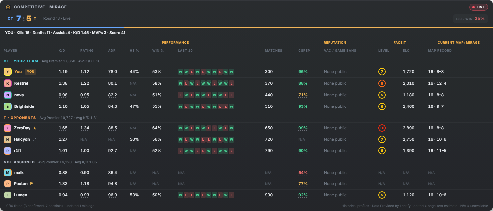 | 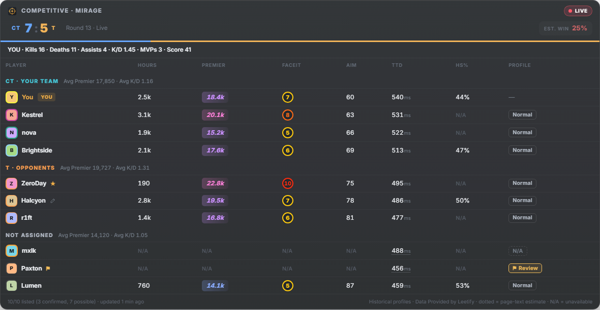 |

| Player overview | Recent matches |
|---|---|
| 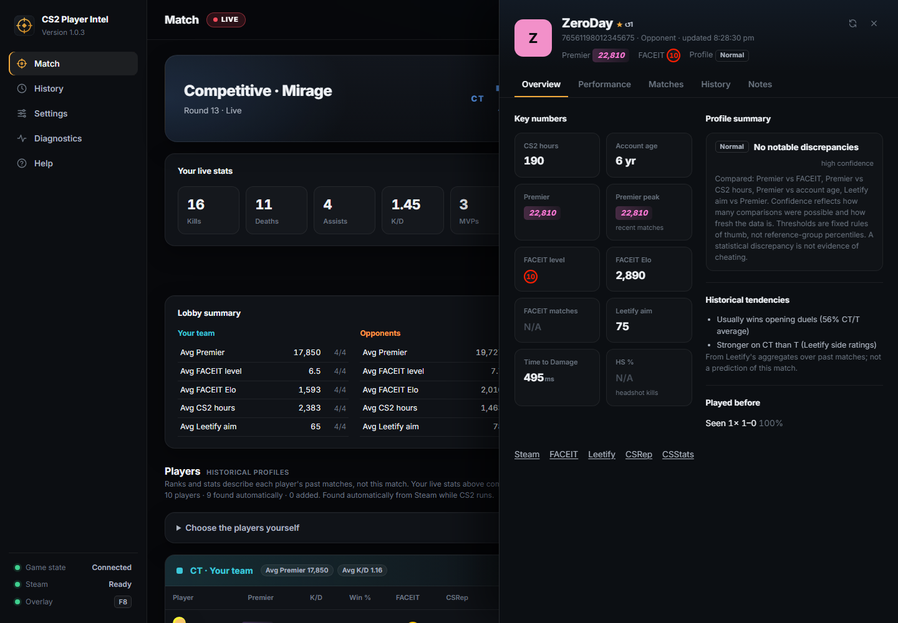 | 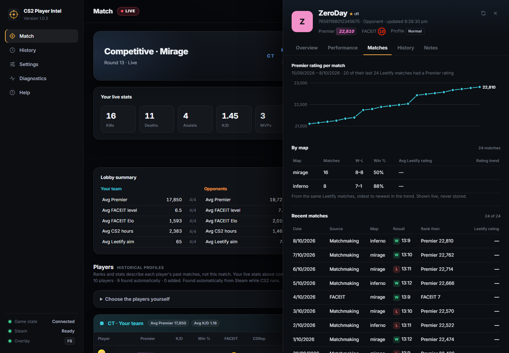 |

<details>
<summary>Settings, local history, first-run setup, Help, and alternate themes</summary>

| Data sources | General settings |
|---|---|
| 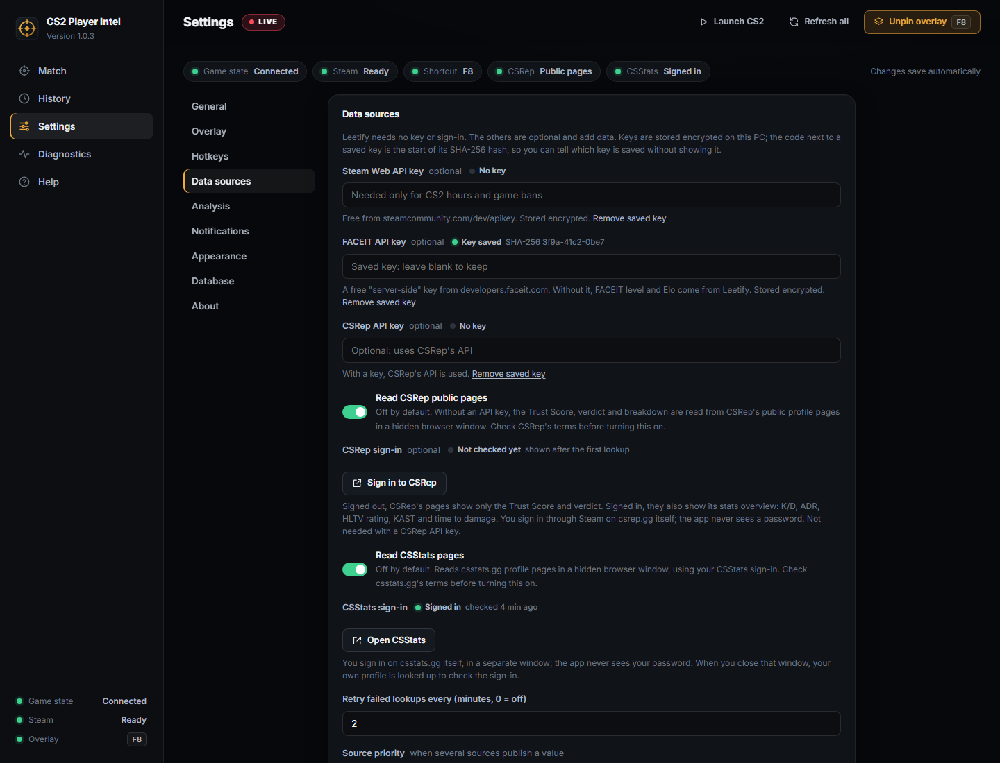 | 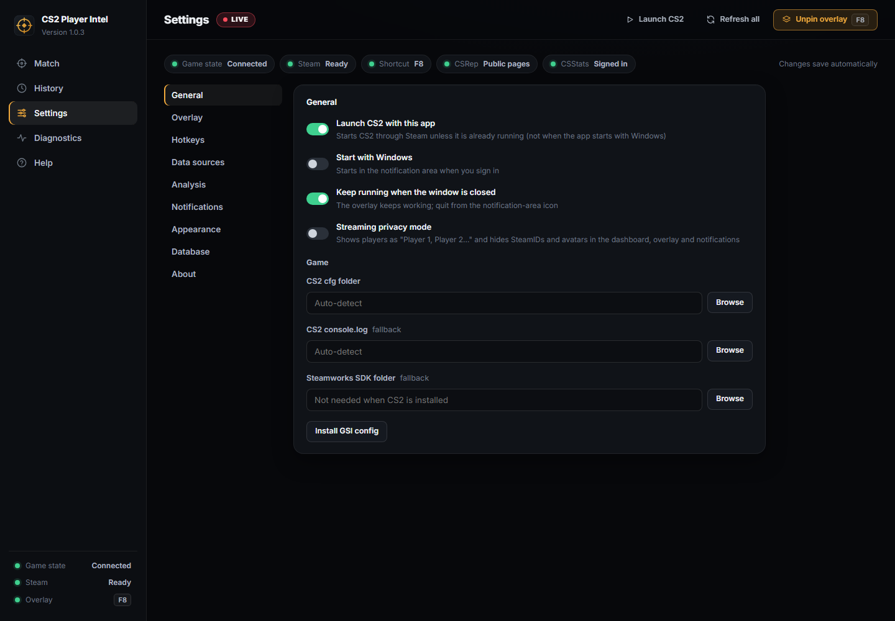 |

| Match history | Local player history |
|---|---|
| 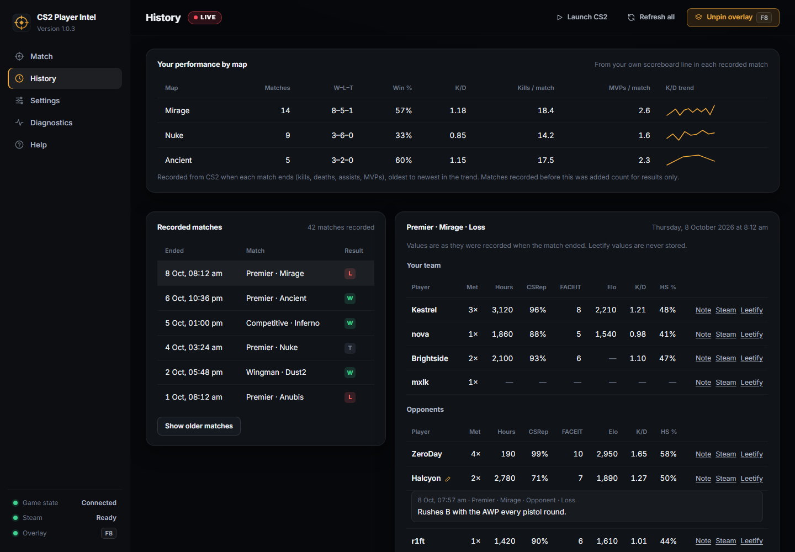 | 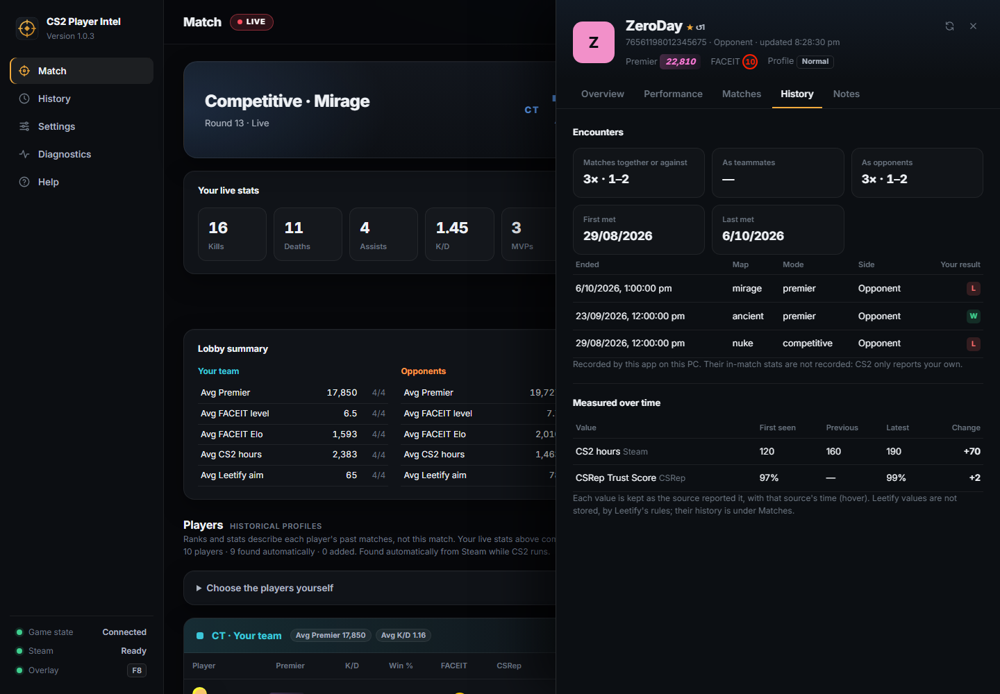 |

| First-run setup | Light theme |
|---|---|
| 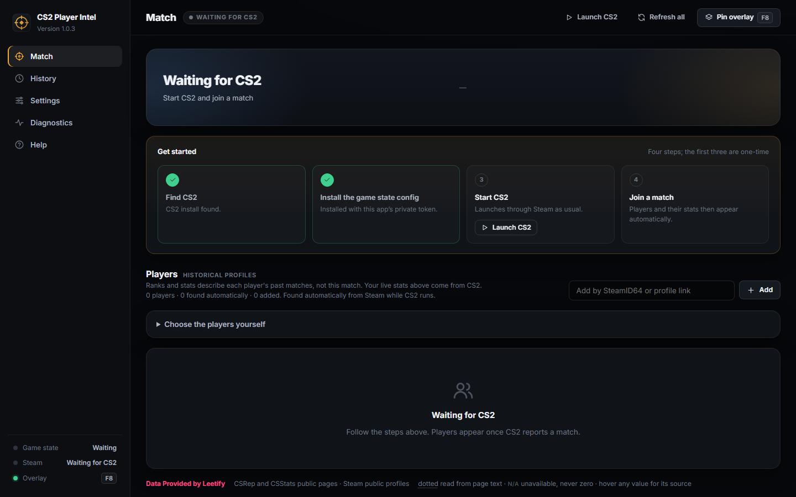 | 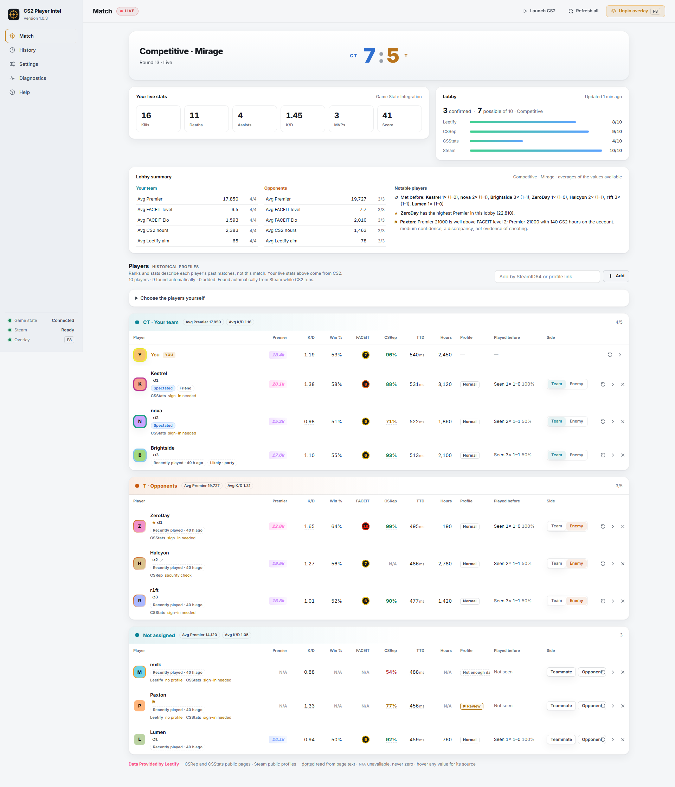 |

| Minimal overlay | |
|---|---|
| 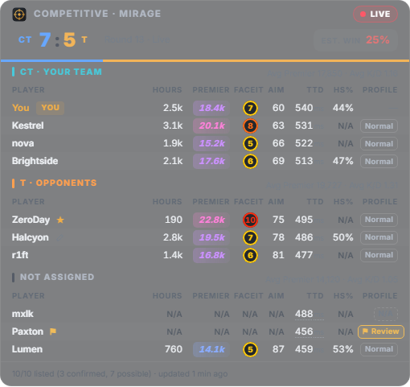 | |

| About and updates | Built-in Help |
|---|---|
| 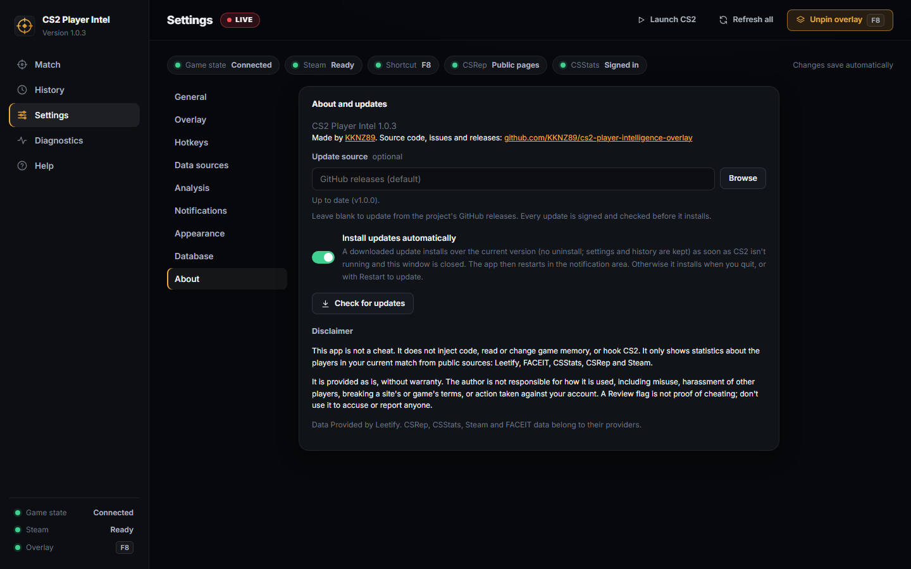 | 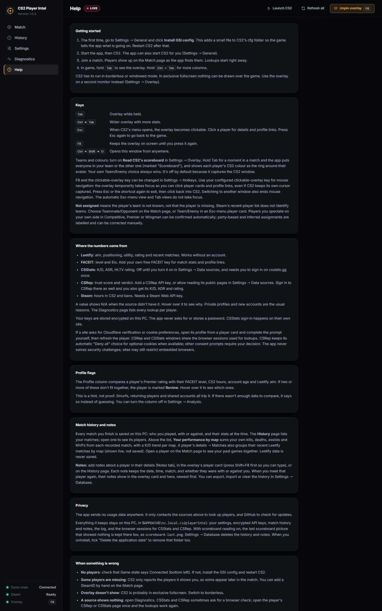 |

</details>

## Building from source

Requires Node.js 24, stable Rust with the MSVC toolchain, Visual Studio Build Tools with Desktop development with C++, the Windows SDK, and WebView2. Microsoft Edge is also required for the screenshot command.

From the repository root, enter `CS2PlayerIntel-rs` before running these commands. The backend is [Rust with Tauri 2](src-tauri/src); the interface is [plain HTML, CSS and JavaScript](ui).

```powershell
Set-Location .\CS2PlayerIntel-rs
npm ci
npm start                     # run from source
npm run check                 # rustfmt, clippy, Rust and UI tests, smoke test
npm run build                 # Tauri release build; updater artifacts require a signing key
npm run screenshots           # render docs/screenshots from sample data (headless Edge)
npm run probe:steam           # check the Steam helper (Steam counts it as CS2 while it runs)
```

Run `probe:steam` only with CS2 closed. The screenshot command does not contact Steam, CS2, or the providers; it reads the application version from `package.json`. It waits for fixture rendering, the selected views, fonts, images, and animations rather than fixed delays. Browser connections and commands have 10-second deadlines; page errors or missing controls fail the run. Startup and capture failures still close the server and browser and remove the temporary profile, with cleanup failures reported explicitly.

| Area | Modules |
|---|---|
| Wiring | `main.rs`, `engine.rs`, `commands.rs` |
| Match | `match_controller.rs`, `lifecycle.rs`, `modes.rs` |
| Teams | `team_inference.rs`, `prediction.rs` |
| Data | `player_data.rs`, `providers/*`, `analysis.rs` |
| Steam | `steam.rs`, `roster.rs` |
| Game | `gsi.rs`, `gsi_config.rs`, `console_roster.rs`, `game.rs` |
| Overlay | `overlay.rs`, `key_watcher.rs` |
| Other | `settings.rs`, `match_history.rs`, `notifications.rs`, `diagnostics.rs`, `updater.rs`, `tray.rs` |

The Windows [CI workflow](../.github/workflows/verify.yml) runs lint, unit tests, the desktop smoke test, and an installer build without update signatures. Tests and fixtures do not prove that live provider data is correct or certify anti-cheat compatibility. Check real-match operation and provider sign-in before publishing a release.

## Troubleshooting

| Problem | Check |
|---|---|
| No game-state connection | Install the GSI config, restart CS2, and check Diagnostics. Another app must not be using GSI port 31982. |
| Overlay is not visible | Use borderless/windowed mode, check the chosen monitor and trigger, and try pinning it with F8. |
| Players are missing or only marked possible | Steam's co-play list is evidence, not a guaranteed complete roster. Use manual player selection or the console-log fallback. |
| A value is N/A | Hover it or open Diagnostics for the reason: private profile, rate limit, missing key, sign-in, or verification. |
| CSRep or CSStats needs verification or cookie preferences | Open that profile from the app, complete the site's check or choose cookie preferences yourself, then refresh the player. Browser sessions are remembered. CSRep retains its automatic "Deny all" choice for optional cookies when available; other consent prompts require your decision. Security challenges are never solved automatically, and sites may restrict embedded browsers. |
| A shortcut cannot register | Choose a different combination in Settings; another application may already use it. |
| Windows shows a SmartScreen warning | The installer lacks Authenticode signing. Download only from the project's release page; do not disable Windows protection globally. |

## Building a release

Run from the application folder after testing the application and checking it in a real match. Keep the versions in `package.json`, `package-lock.json`, `src-tauri/Cargo.toml`, and `src-tauri/Cargo.lock` in sync; `npm version` does not update the Rust files.

```powershell
npm version minor --no-git-tag-version
npm run dist                  # signed installer, .sig and latest.json in release/
```

`npm run dist` signs the installer for the updater with `%USERPROFILE%\.cs2intel\updater.key` (or `TAURI_SIGNING_PRIVATE_KEY`). Keep that key safe and backed up: installed copies only accept updates signed with it.

Installed copies check `releases/latest/download/latest.json` every 30 minutes and download new versions in the background. An update installs over the current version, with no uninstall, and keeps settings and history. With **Install updates automatically** on (the default), it installs by itself as soon as CS2 isn't running and the app's window is closed, and the app restarts in the notification area. Otherwise it installs when you quit or click **Restart to update**. **Update source** in Settings can point at another `https://` feed or a local release folder instead.

Never commit the updater private key, provider keys, browser profiles, or personal match-history exports.

## Support and contributing

[Report a bug or request a feature](https://github.com/KKNZ89/cs2-player-intelligence-overlay/issues). Report security problems privately, as described in [SECURITY.md](../SECURITY.md). Include the app version, Windows version, CS2 display mode, reproduction steps, expected and actual behavior, and relevant redacted Diagnostics output. Remove API keys, GSI tokens, personal paths, and player identifiers you do not want public.

For a contribution, keep changes focused, run `npm run check`, and explain any changes to roster confidence, source attribution, persistence, or the non-invasive game boundary. Discuss substantial changes in an issue first. Do not submit injection, memory-access, gameplay-automation, or provider-verification bypass features.

## License

MIT. See [LICENSE](LICENSE). CS2, Steam, and provider names belong to their respective owners; this project is not affiliated with or endorsed by Valve, FACEIT, Leetify, CSStats, or CSRep.
